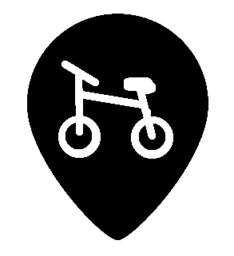

 # ClearYourRide 
 A Cordova App to reprort grievances in the urban cycling infrastructure. 

 The Erläuterung_Implementierung_CYR.pdf is a detailed description of the App, but unfortunatly in German.

 1. To start the app you need to [install cordova](https://cordova.apache.org/docs/en/10.x/guide/cli/).
 2. You need to install the plugins **cordova-plugin-camera** and **cordova-plugin-geolocation**
 3. Go to the repository in the Terminal
 4. Start the app by `cordova run android`

  

